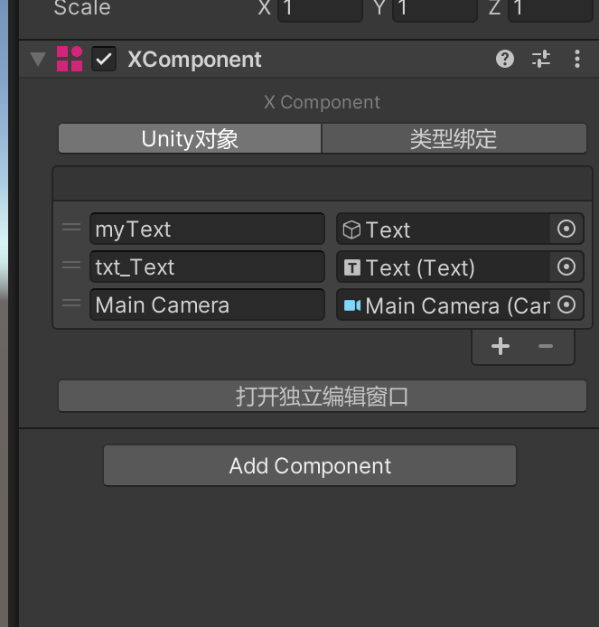
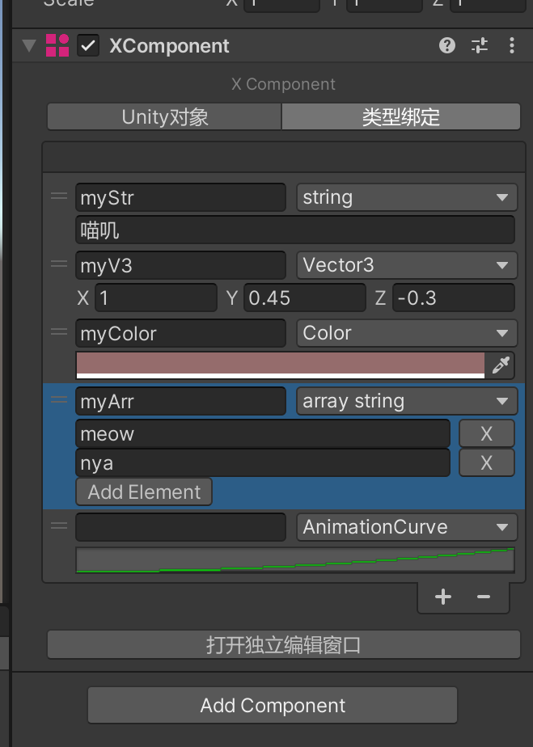
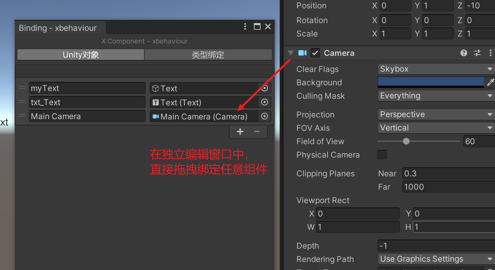
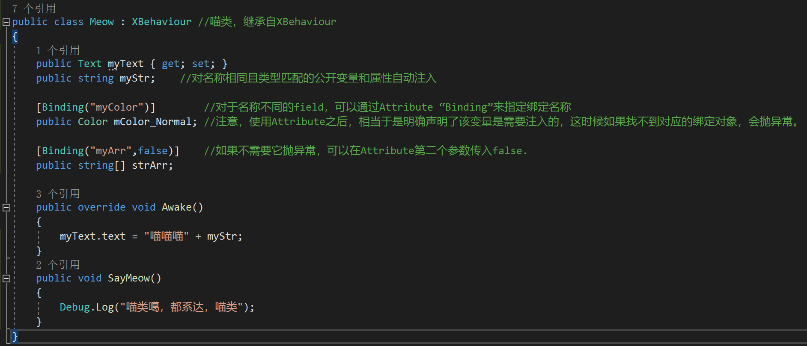
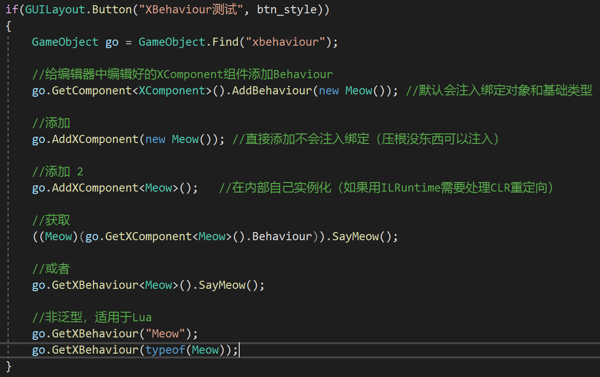

# TinaX Framework - X Component.

<a href="https://tinax.corala.space" target="_blank"></a>

[-blue.svg)](https://github.com/996icu/996.ICU/blob/master/LICENSE)
<a href="https://996.icu"></a>
[](https://github.com/yomunsam/TinaX/blob/master/LICENSE)

让Unity Component脱离对MonoBehaviour的直接依赖。

Remove Unity Component from its direct dependency on MonoBehaviour.

<br>

## Install this package

### Install via git UPM:

您可以使用Unity Package Manager来安装使用该包。

You can use the Unity Package Manager to install and use this package.  

```
git://github.com/yomunsam/TinaX.XComponent.git
```

package name: `io.nekonya.tinax.xcomponent`

If you want to set a target version, you can use release tag like `#6.6.0-preview`. for detail you can see this page: [https://github.com/yomunsam/TinaX.XComponent/releases](https://github.com/yomunsam/TinaX.XComponent/releases)

<br>

### Install via npm (UPM)

Modify `Packages/manifest.json` file in your project, and add the following code before "dependencies" node of this file:

``` json
"scopedRegistries": [
    {
        "name": "TinaX",
        "url": "https://registry.npmjs.org",
        "scopes": [
            "io.nekonya"
        ]
    }
],
```

<br>

------

## Dependencies

This package does not depend on other packages.

<!-- 在安装之前，请先确保已安装如下依赖：

Before setup `TinaX.MonoBehaviour`, please ensure the following dependencies are installed by `Unity Package Manager`:

- [io.nekonya.tinax.core](https://github.com/yomunsam/tinax.core) :`git://github.com/yomunsam/TinaX.Core.git` -->

<!-- ------

## Third-Party

本项目中使用了以下优秀的第三方库：

The following excellent third-party libraries are used in this project:

- **[ILRuntime](https://github.com/Ourpalm/ILRuntime)** : Pure C# IL Intepreter Runtime, which is fast and reliable for scripting requirement on enviorments, where jitting isn't possible. -->

-------

The following documents are written in the author's native language. English documentation will be completed later.

> The editor UI will automatically switch between Chinese and English based on the system language.
>
> 编辑器UI会根据系统语言自动切换中英语言。

无论是C#还是Lua， 在热更新项目中，我们是无法直接编写Component的。

一方面，Unity的编辑器不可能在Lua或者C#热更新Dll中读取组件来， 另一方面，对原生代码中的`MonoBehaviour`进行热修补也是所有热更新方案中不推荐的做法。

`XComponent` 将组件在编辑器上的部分和代码逻辑部分相互分离，为各种热更新方案提供便利。

> TinaX.XComponent 虽然是TinaX Framework的一部分，但它没有依赖任何其他Package，甚至没有依赖`TinaX.Core`包。这意味着，任何人可以很轻易的把它放进各自不同的项目中，而不需要引入整套TinaX Framework的解决方案。

### 编辑器中的XComponent

XCompoent组件用于绑定各种Unity对象和基础类型数据，以代替MonoBehaviour中通过`public`变量的方式在编辑器进行对象绑定。



除了`UnityEngine.Object`对象之外，XComponent还可以绑定各种基础类型数据。并且这部分支持哪些数据是可以自由扩展的。


打开独立编辑窗口，我们可以精确的直接拖拽任何Unity对象进行绑定，而不是只能绑定GameObject和Prefab.



### 用于Lua方案

直接新建一个类，继承自`TinaX.XComponent.XComponentScriptBase`类，添加个TextAssets的Field，它就成了一个典型的`MonoBehaviour`了。

### 用于C#方案

代码和数据绑定是分开在不同的类中的：XComponent为C#提供了`XBehaviour`类来编写逻辑代码，`XBehaviour`是独立的抽象类，没有继承自`MonoBehaviour`.

使用C#做热更新的话，直接在热更新工程中继承`XBehaviour`即可。



GetComponent和AddComponent，也都很方便。


